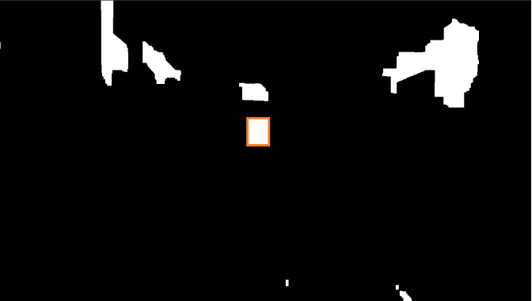
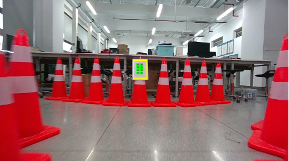
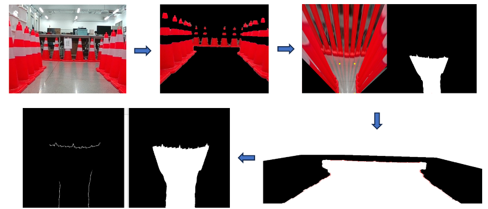
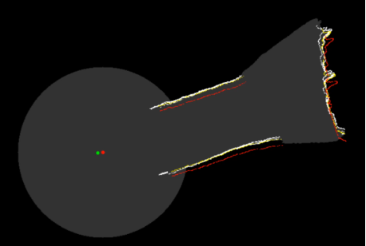
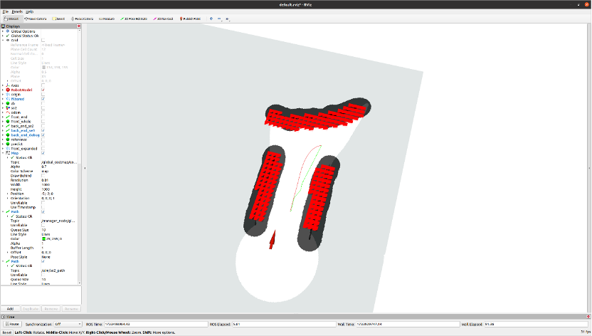
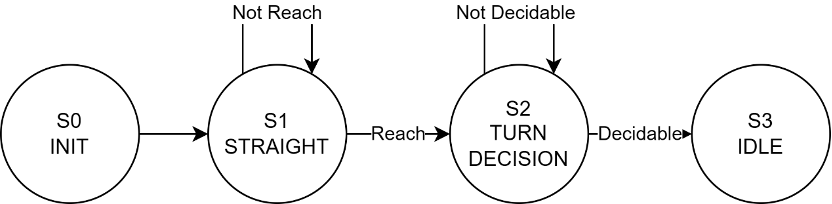
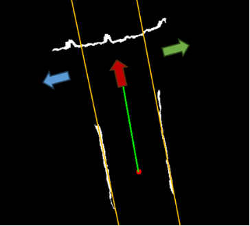

# 哈尔滨工业大学（深圳）数字图像处理课程设计

> 本项目采用 [WTFPL](http://www.wtfpl.net/) 进行授权，包含其他授权协议的部分按对应协议进行授权。本项目没有任何可靠性担保。

## 概述

本次实验基于 SLAM（同步定位与建图）思想，设计并实现了一个视觉小车系统，主要包括识别模块、建图模块和规划模块。实验重点在于通过视觉感知和地图构建，结合路径规划和状态机决策，实现小车自主导航与目标点追踪的功能。本项目的创新点在于基于多尺度模板匹配的视觉识别方法以及简化版 SLAM 的优化建图流程。

## 课程设计任务及要求

 **任务目标**：

* 实现视觉小车的识别、建图、规划和决策功能。
* 基于视觉信息完成环境地图构建，并通过路径规划实现小车自主导航。
* 通过状态机实现不同导航状态的切换。

 **设计要求**：

* 使用高效的视觉识别算法减少计算量，提高实时性。
* 建立局部与全局地图，通过优化算法提高地图精度。
* 符合机器人运动学约束，完成路径规划的平滑优化。
* 提交实验报告，详细记录方案设计、实验过程与结果。

## 算法设计

 **识别模块**：

* **A4白纸矩形兴趣区域识别**：通过阈值分割、开运算和孔洞填充等方法，筛选矩形几何特性和位置特性的兴趣区域，以减少计算量。

  1. 灰度图阈值分割

  * **目标**：直接对灰度图进行阈值分割，将A4白纸区域从背景中提取出来。
  * **灰度图转换**：将原始彩色图像转换为灰度图，以降低处理的复杂度。
  * **阈值分割**： 使用固定阈值或自适应阈值的方法对灰度图进行二值化。固定阈值：选取合适的亮度阈值（如200）将白纸区域提取为高亮（白色，值为255），背景为黑色（值为0）。自适应阈值：根据局部像素值的变化动态调整阈值，适应不同光照条件。
  * **效果**：通过亮度的显著差异，将A4白纸区域清晰分离。

  2. 图像形态学处理

  * **目标**：进一步清理二值化图像，增强白纸区域的完整性。
  * **开运算**：先腐蚀后膨胀，去除噪声点和小区域干扰，同时保持白纸边缘的几何完整性。
  * **孔洞填充**：通过区域填充算法，将白纸内部可能存在的孔洞（如亮度不均导致的空洞）进行填补，防止孔铜进一步腐蚀破坏矩形。
  * **边缘平滑**：使用中值滤波减少边缘噪声对后续轮廓提取的干扰。

  3. 矩形几何特性筛选

  * **目标**：在二值图中筛选符合A4白纸特性的区域。
  * **轮廓检测**：提取所有轮廓。
  * **凸四边形约束**：仅保留边数为4的凸四边形。
  * **长宽比约束**：计算每个连通域的长宽比，筛选接近A4纸比例（1:√2）的矩形。
  * **面积约束**：剔除面积过小或过大的连通域。
  * **内角约束**：通过边缘检测，检测矩形的四个角点，确保内角接近直角。

  4. 矩形位置特性筛选

  * **目标**：确保候选矩形为水平放置的A4白纸。
  * **外接矩形角度检测**：检测每个连通域的最小外接矩形，计算矩形的旋转角度，剔除倾斜度较大的区域。

  5. 验证与实验结果

  * **实验设置**：在光照均匀和不均匀的环境下分别测试，分辨率为1280x720。
  * **结果**： 灰度图阈值分割结合形态学处理后，A4白纸检测的准确率达97%以上。固定阈值方法在光照均匀的环境中表现优异，自适应阈值在复杂光照条件下表现更为鲁棒。优化后的兴趣区域方法减少了98.5%的计算量，模板匹配从遍历1280\*720的区域减少到只需遍历小于120\*120的区域，识别时间从1秒/帧降低到15毫秒/帧。

  

* **多尺度模板匹配**[^1]：针对蓝色和绿色药丸的识别问题，采用降采样/上采样多尺度模板投票的方法，克服缩放不变性问题。

  1. 模板的多尺度生成

  * **目标**：生成适应药丸大小变化的多尺度模板，用于克服缩放不变性。
  * **降采样**：对基础模板进行下采样（如每次减少20%的分辨率），生成若干小尺寸模板，适用于远距离的药丸检测。
  * **上采样**：对基础模板进行上采样（如每次放大20%），生成若干大尺寸模板，适用于近距离的药丸检测。
  * **多尺度模板池**：通过降采样和上采样，最终构建一个多尺度模板集合,其中​表示第个尺度的模板。

  2. 模板匹配

  * **目标**：计算模板与兴趣区域的相关性分数，并选择最优结果。
  * **相关性计算**：对每个兴趣区域的图像矩阵和模板矩阵 ​，计算两者的相关性分数（如归一化互相关，NCC）。公式： 其中，和 分别为和的均值。
  * **多尺度匹配**：对每个模板 ​，逐一计算其与兴趣区域的相关性分数。在所有模板中，选取得分最高的模板对应的匹配区域。

  3. 投票机制

  * **目标**：在多尺度模板匹配结果中剔除误检，提高鲁棒性。
  * **方法**：
  * 将不同模板匹配到的区域按照相关性分数进行排序。
  * 应用非极大值抑制（NMS），去除相互重叠且得分较低的候选区域。
  * 对每个区域，根据匹配到的模板投票计数：
  * 蓝色药丸的模板得分计入蓝色票数；
  * 绿色药丸的模板得分计入绿色票数。
  * 最终选择投票结果最高且得分超过0.8的6个蓝色区域和8个绿色区域作为识别结果。

  

 **建图模块**：

* **前端感知**：纯视觉的路面/路缘识别
  1. 利用颜色分割提取红色区域
  2. 利用透视变换生成俯视图，提取路面连通域
  3. 利用透视特性，判断下侧接触路面的边缘为路缘

* **后端优化**：基于 Elastix1[^2] 和 ITK[^3] 的配准工具，优化局部图到全局图的配准，得到优化后的定位与建图结果。
  1. **准则**：均方差函数
  2. **优化方法**：梯度下降法
  3. **约束条件**：刚性变换（平移+旋转）

 **规划模块**：

* 应用A\*算法进行前端路径规划，结合 Minimum Snap 算法[^4]对路径进行平滑处理，使其满足机器人运动学约束。由于时间仓促，没能成功应用更先进的 Ego-Planner[^5] 。

 **决策模块**：

* 基于状态机模型，设计包括初始化、直行、转弯和待机四种状态，结合识别模块和地图信息生成目标点。
* 具体状态转移规则：
  + S0 初始化状态
    - 直接进入 S1
  + S1 直行状态
    - 未到达转弯点 S1
    - 到达转弯点 S2
  + S2 转弯抉择
    - 识别未完成 S2
    - 识别完成 S3
  + S3 待机

* 目标点逻辑：
  + **直行目标点**：对全局图路缘进行霍夫变换，合适阈值提取直道部分，分左右两类对识别得到的直线取平均得到道路两侧线，再对两侧线取平均得到道路中心线，设定合适的到路缘距离给点。
  + **转弯目标点**：根据药片识别结果得到左右，基于上一部分直行给点设定合适旋转距离给点。

## 参考文献

[^1]: X. Qi and L. Miao, "A Template Matching Method for Multi-Scale and Rotated Images Using Ring Projection Vector Conversion," 2018 IEEE 3rd International Conference on Image, Vision and Computing (ICIVC), Chongqing, China, 2018, pp. 45-49, doi: 10.1109/ICIVC.2018.8492726.

[^2]: S. Klein, M. Staring, K. Murphy, M. A. Viergever and J. P. W. Pluim, "elastix: A Toolbox for Intensity-Based Medical Image Registration," in IEEE Transactions on Medical Imaging, vol. 29, no. 1, pp. 196-205, Jan. 2010, doi: 10.1109/TMI.2009.2035616.

[^3]: McCormick M, Liu X, Jomier J, Marion C, Ibanez L. ITK: enabling reproducible research and open science. Front Neuroinform. 2014;8:13. Published 2014 Feb 20. doi:10.3389/fninf.2014.00013

[^4]: D. Mellinger and V. Kumar, "Minimum snap trajectory generation and control for quadrotors," 2011 IEEE International Conference on Robotics and Automation, Shanghai, China, 2011, pp. 2520-2525, doi: 10.1109/ICRA.2011.5980409.

[^5]: X. Zhou, Z. Wang, H. Ye, C. Xu and F. Gao, "EGO-Planner: An ESDF-Free Gradient-Based Local Planner for Quadrotors," in IEEE Robotics and Automation Letters, vol. 6, no. 2, pp. 478-485, April 2021, doi: 10.1109/LRA.2020.3047728.
